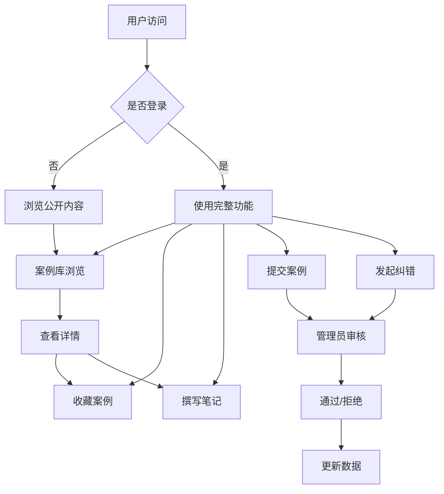

# 创业尸体库 - 产品需求文档

## 1. 产品概述

**创业尸体库（Startup Graveyard）** 是一个专注于记录和分析创业失败案例的知识库平台，为创业者、投资人和研究人员提供深度的失败案例研究资源。通过系统化的案例拆解、透明的失败原因分析和实用的经验借鉴，帮助用户从失败中学习，降低创业风险。

**目标用户：**
- 创业者：学习他人失败教训，避免常见错误
- 投资人：识别风险信号，优化投资决策
- 研究人员：研究创业生态，分析失败规律

**核心价值：**
- 真实案例的深度拆解
- 多维度的案例检索和对比
- 社区贡献和知识共建
- 专业的数据分析和洞察

## 2. 核心功能

### 2.1 用户角色

| 角色 | 注册方式 | 核心权限 |
|------|----------|----------|
| 访客 | 无需注册 | 浏览公开案例，查看筛选结果 |
| 普通用户 | 邮箱注册 | 收藏案例、撰写笔记、提交案例、纠错申请 |
| 管理员 | 系统分配 | 审核投稿、合并项目、维护标签、生成榜单 |

### 2.2 功能模块

#### 2.2.1 首页
- **统计数据展示**：总案例数、行业分布、年度趋势
- **精选案例推荐**：编辑推荐的深度分析案例
- **近期关闭项目**：最近关闭的热门项目
- **专题入口**：快速访问热门专题（烧钱过快、转型失败等）
- **社区动态**：最新提交和审核通过的案例

#### 2.2.2 案例库
- **多维度筛选**：
  - 行业（电商、教育、医疗、金融科技、人工智能等）
  - 地区（华北、华东、华南、华中、海外等）
  - 阶段（种子轮、A轮、B轮、C轮及以上、IPO前）
  - 融资规模（100万以下、100-500万、500-2000万、2000万以上）
  - 关闭年份（2015-2025）
- **视图切换**：卡片视图 / 列表视图
- **排序选项**：按时间、融资额、热度排序
- **搜索功能**：关键词全文搜索

#### 2.2.3 案例详情页
- **项目概览**：名称、logo、行业、地区、存活时间
- **核心产品**：产品介绍、核心功能、目标用户
- **项目时间线**：从成立到关闭的关键里程碑
- **团队变化**：创始团队、核心成员变动
- **融资记录**：轮次、金额、投资方、时间
- **失败原因拆解**：
  - 外部因素（市场环境、政策变化、竞争压力）
  - 内部因素（资金管理、团队问题、战略失误、产品问题）
- **可借鉴经验**：从失败中提炼的教训和行动建议
- **参考资料**：公开报道、官方声明、来源链接
- **社区互动**：收藏数、评论数、纠错状态

#### 2.2.4 案例提交页
- **基础信息**：项目名称、行业、地区、成立时间、关闭时间
- **产品描述**：核心产品、主要功能、目标用户
- **融资信息**：融资轮次、金额、投资机构
- **失败分析**：失败原因分类选择、详细描述
- **经验总结**：可借鉴的经验教训
- **参考资料**：新闻链接、官方公告
- **图片上传**：项目截图、产品演示（可选）

#### 2.2.5 专题看板
- **专题分类**：
  - 烧钱过快：资金消耗速度过快的案例
  - 转型失败：多次转型未果的案例
  - 创始人离场：创始人退出导致的失败
  - 竞争淘汰：被竞争对手击败的案例
  - 政策风险：受政策影响关闭的案例
  - 团队内斗：团队矛盾导致的失败
- **专题详情**：专题介绍、案例列表、统计数据
- **自定义专题**：管理员可创建新专题

#### 2.2.6 个人收藏页
- **收藏管理**：收藏的案例列表，支持取消收藏
- **私密笔记**：
  - 为每个案例撰写私有笔记
  - 笔记仅对自己可见
  - 支持Markdown格式
  - 笔记搜索和筛选
- **提交记录**：我提交的案例及审核状态
- **纠错记录**：我发起的纠错及处理状态

### 2.3 用户交互流程

#### 2.3.1 案例浏览流程
```
首页 → 案例库 → 选择筛选条件 → 浏览案例列表 → 点击案例 → 案例详情页
```

#### 2.3.2 案例提交流程
```
首页/案例库 → 提交案例 → 填写表单 → 提交审核 → 等待审核 → 审核通过/拒绝通知
```

#### 2.3.3 纠错流程
```
案例详情 → 发起纠错 → 选择纠错类型 → 填写纠错内容 → 提交 → 管理员审核 → 反馈结果
```

## 3. 核心流程



## 4. 用户界面设计

### 4.1 设计风格

**设计理念：墓碑美学 × 现代极简**
- 整体色调偏冷，以深灰、墨蓝为主色调，传达"失败"的主题感
- 使用墓碑、石碑等视觉元素作为装饰，但保持现代简约
- 卡片设计采用阴影和渐变，营造层次感和深度
- 强调数据可视化，用图表展示统计信息

**配色方案：**
- 主色：#1a1a2e（深墨蓝）
- 次色：#16213e（暗蓝灰）
- 强调色：#e94560（警示红）
- 成功色：#4ecca3（薄荷绿）
- 背景色：#0f0f23（深夜蓝）
- 文字色：#eaeaea（浅灰白）

**字体选择：**
- 标题字体：Noto Serif SC（衬线体，传达权威和深度）
- 正文字体：Noto Sans SC（无衬线体，现代清晰）
- 数字字体：JetBrains Mono（等宽字体，数据展示）

**按钮样式：**
- 圆角按钮（border-radius: 8px）
- 悬停效果：轻微上浮 + 阴影加深
- 主按钮：实心背景 + 白色文字
- 次按钮：边框 + 透明背景

**图标风格：**
- 使用Lucide Icons（线性风格）
- 配合墓碑、蜡烛、书籍等主题图标

**布局风格：**
- 顶部导航 + 侧边筛选
- 卡片网格布局（案例库）
- 沉浸式单页布局（案例详情）
- 仪表盘风格（个人中心）

### 4.2 页面设计

#### 首页布局
- **Hero区域**：大标题 + 统计数据（总案例数、总投资额、案例行业分布图）
- **精选案例区**：横向滚动的案例卡片
- **专题入口区**：六宫格专题按钮
- **最新关闭区**：时间线样式的案例列表
- **页脚**：版权信息、联系方式

#### 案例库布局
- **左侧筛选栏**：多选筛选条件，支持折叠
- **主内容区**：案例卡片网格（3列）
- **顶部工具栏**：视图切换、排序、搜索框
- **分页控制**：底部数字分页

#### 案例详情布局
- **顶部信息栏**：项目logo、名称、存活时间
- **标签栏**：行业、地区、阶段标签
- **时间线模块**：垂直时间线展示关键事件
- **产品模块**：图文介绍核心产品
- **团队模块**：创始团队和变动记录
- **融资模块**：融资表格和时间线
- **失败原因模块**：分类卡片展示
- **经验模块**：要点列表
- **参考资料模块**：外部链接列表
- **侧边栏**：收藏按钮、笔记入口、纠错入口

#### 案例提交布局
- **步骤指示器**：3步流程（基本信息 → 详细信息 → 提交）
- **表单区域**：分组表单，卡片式布局
- **预览区域**：实时预览提交效果
- **提交按钮**：底部固定

#### 专题看板布局
- **专题选择区**：标签式专题切换
- **专题介绍区**：专题说明 + 统计数据
- **案例列表区**：该专题下的所有案例

#### 个人收藏布局
- **侧边导航**：收藏列表 / 笔记列表 / 提交记录 / 纠错记录
- **列表区域**：收藏的案例卡片
- **详情面板**：选中案例的详细信息和笔记编辑

### 4.3 响应式设计

- **桌面端（1200px+）**：完整三栏布局
- **平板端（768px-1199px）**：双栏布局，侧边栏可折叠
- **移动端（<768px）**：单栏布局，底部标签导航

### 4.4 动效设计

- **页面切换**：淡入淡出（opacity 0→1, 300ms ease）
- **卡片悬停**：轻微上浮（translateY -4px）+ 阴影加深
- **数据加载**：骨架屏 + 渐显
- **筛选切换**：平滑过渡动画
- **专题切换**：滑动切换效果
- **收藏动画**：心形图标弹跳效果

## 5. 数据结构

### 5.1 案例数据
```typescript
interface Case {
  id: string;
  name: string;
  logo: string;
  industry: string;
  region: string;
  foundedYear: number;
  closedYear: number;
  stage: string;
  fundingAmount: number;
  products: Product[];
  timeline: TimelineEvent[];
  team: TeamMember[];
  fundingRecords: FundingRecord[];
  failureReasons: FailureReason[];
  lessons: string[];
  references: Reference[];
  stats: {
    views: number;
    favorites: number;
    corrections: number;
  };
  status: 'pending' | 'approved' | 'rejected';
  createdAt: string;
  updatedAt: string;
}
```

### 5.2 用户数据
```typescript
interface User {
  id: string;
  email: string;
  name: string;
  role: 'user' | 'admin';
  favorites: string[];
  notes: Note[];
  submissions: string[];
  corrections: Correction[];
}
```

## 6. 技术选型

### 6.1 前端技术栈
- React 18
- TypeScript
- Vite（构建工具）
- Tailwind CSS（样式框架）
- React Router（路由管理）
- Zustand（状态管理）
- Lucide React（图标库）
- Recharts（数据可视化）

### 6.2 项目结构
```
src/
├── components/      # 通用组件
├── pages/           # 页面组件
├── hooks/           # 自定义Hooks
├── stores/          # 状态管理
├── data/            # Mock数据
├── types/           # TypeScript类型定义
├── utils/           # 工具函数
└── styles/          # 全局样式
```

## 7. 里程碑计划

### Phase 1 - 核心框架（MVP）
- 项目初始化和基础配置
- 路由和页面框架搭建
- Mock数据结构定义
- 首页和案例库基础功能
- 案例详情页基础布局

### Phase 2 - 核心功能
- 多维度筛选功能
- 收藏和笔记功能
- 案例提交表单
- 专题看板
- 个人收藏页

### Phase 3 - 增强功能
- 用户认证系统
- 管理员功能
- 纠错系统
- 响应式优化
- 动画效果增强

### Phase 4 - 完善和优化
- 性能优化
- SEO优化
- 数据完善
- 社区功能
- 移动端适配
