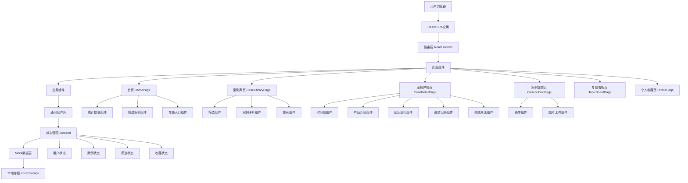
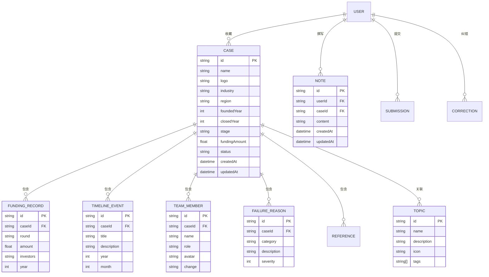

# 创业尸体库 - 技术架构文档

## 1. 架构设计



## 2. 技术栈说明

### 2.1 核心框架
- **React 18**：声明式UI库，支持函数式组件和Hooks
- **TypeScript**：类型安全的JavaScript超集
- **Vite**：快速的现代化构建工具

### 2.2 样式方案
- **Tailwind CSS**：原子化CSS框架，快速构建响应式界面
- **CSS变量**：统一管理主题色彩和间距

### 2.3 路由管理
- **React Router v6**：SPA路由解决方案，支持嵌套路由和路由守卫

### 2.4 状态管理
- **Zustand**：轻量级的状态管理库，API简洁直观

### 2.5 工具库
- **Lucide React**：高质量的SVG图标库
- **Recharts**：React图表库，用于数据可视化
- **date-fns**：日期处理库

## 3. 路由定义

| 路由路径 | 页面组件 | 功能描述 | 访问权限 |
|---------|---------|----------|----------|
| / | HomePage | 首页 | 公开 |
| /cases | CaseLibraryPage | 案例库列表 | 公开 |
| /cases/:id | CaseDetailPage | 案例详情 | 公开 |
| /submit | CaseSubmitPage | 提交案例 | 需登录 |
| /topics | TopicBoardPage | 专题看板 | 公开 |
| /topics/:topicId | TopicBoardPage | 专题详情 | 公开 |
| /profile | ProfilePage | 个人中心 | 需登录 |
| /profile/favorites | ProfilePage | 我的收藏 | 需登录 |
| /profile/notes | ProfilePage | 我的笔记 | 需登录 |
| /profile/submissions | ProfilePage | 我的提交 | 需登录 |
| /admin | AdminPage | 管理员面板 | 需管理员 |
| /login | LoginPage | 登录页 | 公开 |
| /register | RegisterPage | 注册页 | 公开 |

## 4. 数据模型

### 4.1 数据模型关系图



### 4.2 数据定义语言

#### 案例表（Mock数据）
```typescript
const mockCases: Case[] = [
  {
    id: '1',
    name: '小蓝单车',
    logo: '/logos/xiaolan.png',
    industry: '出行交通',
    region: '华北',
    foundedYear: 2016,
    closedYear: 2018,
    stage: 'C轮',
    fundingAmount: 150000000,
    products: [
      {
        id: '1',
        name: '小蓝单车App',
        description: '共享单车应用',
        features: ['扫码解锁', 'GPS定位', '信用积分'],
        targetUsers: '城市通勤人群'
      }
    ],
    timeline: [
      { year: 2016, month: 3, title: '公司成立', description: '小蓝单车成立' },
      { year: 2016, month: 6, title: '获得天使轮融资', description: '获得1000万天使轮融资' },
      { year: 2017, month: 1, title: '完成A轮融资', description: '获得1亿A轮融资' },
      { year: 2017, month: 11, title: '资金链断裂', description: '资金链出现问题' },
      { year: 2018, month: 3, title: '宣布关闭', description: '正式宣布关闭' }
    ],
    team: [
      { id: '1', name: '李刚', role: '创始人', avatar: '/avatars/ligang.jpg', change: '离开' },
      { id: '2', name: '王强', role: 'CEO', avatar: '/avatars/wangqiang.jpg', change: '离开' }
    ],
    fundingRecords: [
      { round: '天使轮', amount: 10000000, investors: '个人投资者', year: 2016 },
      { round: 'A轮', amount: 100000000, investors: '红杉资本', year: 2017 },
      { round: 'B轮', amount: 500000000, investors: '腾讯', year: 2017 }
    ],
    failureReasons: [
      { category: '资金管理', description: '扩张速度过快，资金消耗巨大', severity: 5 },
      { category: '市场竞争', description: '面对ofo和摩拜的激烈竞争', severity: 4 },
      { category: '运营问题', description: '车辆维护成本高，用户体验下降', severity: 3 }
    ],
    lessons: [
      '控制扩张速度，确保资金充足',
      '建立有效的成本控制体系',
      '关注竞争对手动向，及时调整策略',
      '保持用户服务质量'
    ],
    references: [
      { title: '小蓝单车倒闭始末', url: 'https://news.example.com/1', source: '财经网' },
      { title: '小蓝单车创始人复盘', url: 'https://news.example.com/2', source: '创业邦' }
    ],
    stats: {
      views: 12580,
      favorites: 892,
      corrections: 3
    },
    status: 'approved',
    createdAt: '2024-01-15T10:00:00Z',
    updatedAt: '2024-01-15T10:00:00Z'
  }
];
```

## 5. 状态管理设计

### 5.1 Store结构

```typescript
// 用户Store
interface UserStore {
  user: User | null;
  isAuthenticated: boolean;
  login: (email: string, password: string) => Promise<void>;
  logout: () => void;
  register: (email: string, password: string, name: string) => Promise<void>;
}

// 案例Store
interface CaseStore {
  cases: Case[];
  currentCase: Case | null;
  filters: FilterState;
  loading: boolean;
  fetchCases: () => Promise<void>;
  fetchCaseById: (id: string) => Promise<void>;
  setFilters: (filters: Partial<FilterState>) => void;
  submitCase: (data: CaseSubmission) => Promise<void>;
}

// 收藏Store
interface FavoriteStore {
  favorites: string[];
  addFavorite: (caseId: string) => void;
  removeFavorite: (caseId: string) => void;
  isFavorite: (caseId: string) => boolean;
}

// 笔记Store
interface NoteStore {
  notes: Note[];
  addNote: (caseId: string, content: string) => void;
  updateNote: (noteId: string, content: string) => void;
  deleteNote: (noteId: string) => void;
  getNoteByCaseId: (caseId: string) => Note | null;
}
```

### 5.2 持久化策略

- **用户信息**：LocalStorage存储，页面刷新后保持登录状态
- **收藏列表**：LocalStorage存储，跨会话同步
- **笔记数据**：LocalStorage存储，支持离线编辑
- **筛选状态**：URL参数同步，支持链接分享

## 6. 组件架构

### 6.1 组件层级

```
App
├── Layout
│   ├── Header
│   │   ├── Logo
│   │   ├── Navigation
│   │   └── UserMenu
│   ├── Sidebar (可选)
│   └── Footer
├── Router
│   ├── HomePage
│   │   ├── HeroSection
│   │   ├── StatsSection
│   │   ├── FeaturedCases
│   │   └── TopicsSection
│   ├── CaseLibraryPage
│   │   ├── FilterPanel
│   │   ├── SearchBar
│   │   ├── CaseGrid
│   │   └── Pagination
│   ├── CaseDetailPage
│   │   ├── CaseHeader
│   │   ├── TimelineSection
│   │   ├── ProductsSection
│   │   ├── TeamSection
│   │   ├── FundingSection
│   │   ├── FailureSection
│   │   └── LessonSection
│   ├── CaseSubmitPage
│   │   ├── StepIndicator
│   │   ├── BasicInfoForm
│   │   ├── DetailForm
│   │   └── PreviewSection
│   ├── TopicBoardPage
│   │   ├── TopicTabs
│   │   ├── TopicHeader
│   │   └── TopicCases
│   └── ProfilePage
│       ├── ProfileSidebar
│       ├── FavoritesList
│       ├── NotesList
│       └── SubmissionsList
└── Modals
    ├── LoginModal
    ├── RegisterModal
    ├── CorrectionModal
    └── NoteEditor
```

## 7. Mock数据策略

### 7.1 初始数据
- 预置20个真实创业失败案例（基于公开信息改编）
- 涵盖多个行业和失败类型
- 包含完整的时间线、融资、团队等详细信息

### 7.2 交互模拟
- 收藏操作：更新本地状态 + LocalStorage持久化
- 笔记操作：更新本地状态 + LocalStorage持久化
- 提交案例：添加到待审核队列（状态为pending）
- 纠错操作：创建纠错记录（状态为pending）

### 7.3 数据一致性
- 所有操作立即反映在UI上
- 页面刷新后从LocalStorage恢复数据
- 提供"重置数据"功能恢复初始状态

## 8. 性能优化策略

### 8.1 代码分割
- 使用React.lazy进行路由级别的代码分割
- 首屏只加载必要的组件

### 8.2 虚拟列表
- 案例库使用虚拟滚动处理大量数据
- 笔记列表使用虚拟滚动

### 8.3 图片优化
- 使用WebP格式（如果浏览器支持）
- 实现懒加载
- 提供占位图

### 8.4 缓存策略
- 案例数据缓存到LocalStorage
- 减少重复请求

## 9. 目录结构

```
startup-graveyard/
├── public/
│   ├── logos/
│   ├── avatars/
│   └── images/
├── src/
│   ├── components/
│   │   ├── common/
│   │   │   ├── Button.tsx
│   │   │   ├── Card.tsx
│   │   │   ├── Modal.tsx
│   │   │   ├── Badge.tsx
│   │   │   └── ...
│   │   ├── layout/
│   │   │   ├── Header.tsx
│   │   │   ├── Footer.tsx
│   │   │   └── Layout.tsx
│   │   ├── case/
│   │   │   ├── CaseCard.tsx
│   │   │   ├── CaseTimeline.tsx
│   │   │   ├── CaseHeader.tsx
│   │   │   └── ...
│   │   ├── filter/
│   │   │   ├── FilterPanel.tsx
│   │   │   ├── SearchBar.tsx
│   │   │   └── ...
│   │   └── topic/
│   │       ├── TopicCard.tsx
│   │       ├── TopicList.tsx
│   │       └── ...
│   ├── pages/
│   │   ├── HomePage.tsx
│   │   ├── CaseLibraryPage.tsx
│   │   ├── CaseDetailPage.tsx
│   │   ├── CaseSubmitPage.tsx
│   │   ├── TopicBoardPage.tsx
│   │   ├── ProfilePage.tsx
│   │   └── AdminPage.tsx
│   ├── hooks/
│   │   ├── useAuth.ts
│   │   ├── useCases.ts
│   │   ├── useFavorites.ts
│   │   └── useNotes.ts
│   ├── stores/
│   │   ├── userStore.ts
│   │   ├── caseStore.ts
│   │   ├── favoriteStore.ts
│   │   └── noteStore.ts
│   ├── data/
│   │   ├── mockCases.ts
│   │   ├── mockTopics.ts
│   │   └── mockUsers.ts
│   ├── types/
│   │   └── index.ts
│   ├── utils/
│   │   ├── formatters.ts
│   │   ├── validators.ts
│   │   └── helpers.ts
│   ├── styles/
│   │   └── index.css
│   ├── App.tsx
│   └── main.tsx
├── index.html
├── package.json
├── tsconfig.json
├── vite.config.ts
├── tailwind.config.js
└── postcss.config.js
```

## 10. 开发规范

### 10.1 命名规范
- 组件文件：PascalCase（如CaseCard.tsx）
- 工具函数：camelCase（如formatters.ts）
- 类型定义：PascalCase（如Case, User）
- 常量：UPPER_SNAKE_CASE

### 10.2 代码规范
- 使用TypeScript严格模式
- 组件使用函数式组件 + Hooks
- 样式优先使用Tailwind CSS
- 避免使用内联样式
- 组件职责单一，避免过度封装

### 10.3 Git规范
- 分支命名：feature/xxx, bugfix/xxx
- Commit信息：中文描述，清晰简洁
- PR描述：包含功能说明和测试结果

### 10.4 测试规范
- 关键组件编写单元测试
- 使用React Testing Library
- 保持测试覆盖率在80%以上
